# Wingman: Meeting and Inbox Copilot for Even Realities G2
---
Welcome to the Wingman repository! This repository contains the glasses plugin and the bridge for a meeting and inbox copilot built for [Even Realities G2] smart glasses. Wingman puts your next meeting, an AI briefing for it and a triaged inbox on the glasses display, and lets you reply to email, send new mail, write meeting follow-ups and create calendar invites by voice, by holding the temple or the [R1 ring] and talking. "Ask Wingman" goes further: a conversation with an agent that can search your mail, open the second result, find a Drive file, add a row to a sheet or check when you're free tomorrow. Nothing is ever sent or changed without your confirmation: every draft, invite and edit opens for review and only goes out when you tap **Send** or **Approve**. The plugin is built using TypeScript, Vite and the [Even Hub SDK], and the bridge is built using Node JS, TypeScript, the Google Workspace APIs, Gemini and Deepgram.

## Features

- Next Meeting: Your next meeting at a glance, with an AI briefing: what it's for, your last email thread with the attendees, and open questions to raise.
- Inbox Triage: Unread mail summarized to one line each and sorted into action, FYI, newsletter and notification, with important messages starred and suggested replies ready to go.
- Voice Replies and New Emails: Hold and say "Thursday works, see you at 12:30" on an email, or "Email Priya that I'm running ten minutes late" from home. Gemini writes the draft and you can redo it by voice.
- Meeting Follow-ups: Dictate a follow-up on a meeting and it is addressed to everyone who attended.
- Calendar Invites: "Lunch with Sam Thursday at 1" becomes an invite with the right attendee, time and length, ready to create.
- Ask Wingman: A conversation with an agent: "what's unread", "open the second one", "reply saying yes", "find the offsite budget sheet", "add a row: Vineyard, 12000", "what's in the launch plan doc", "when am I free tomorrow", "who is Priya". It remembers the conversation, so "that one" and "the second one" work. Gemini chooses from 22 tools over Gmail, Calendar, Contacts, Drive, Docs and Sheets, and Google's Workspace MCP servers can be attached on top (`WORKSPACE_MCP=1`).
- Agent Safety: Every tool that changes something (send, create or change an event, edit a doc, append rows, MCP mutations) only prepares the action. The glasses show a preview and nothing runs until you tap **Approve**, and each prepared action runs at most once.
- Send-once Drafts: Every draft and invite opens for review and only goes out when you pick **Send** (or **Save to Gmail drafts**). Each draft can be sent at most once.
- Live Speech-to-text: Your words appear on the glasses as you speak, streamed from the glasses microphone through the bridge to Deepgram, with a silent-mic watchdog.
- Model Fallback: If Gemini is overloaded or rate limited, the bridge fails over to a lighter model instead of leaving you waiting on the glasses.
- Phone Companion: The phone screen mirrors the glasses and has the same buttons, including **Hold to talk**.
- Demo Mode: `FAKE_GOOGLE=1` serves fixture calendar and inbox data and only logs sends, so you can try every flow with no accounts. Without Gemini or Deepgram keys, canned fakes stand in.
- Dino Run: A pixel-art endless runner on the glasses. Tap to jump, swipe down to duck, and your best score is kept.
- Design: Pixel-accurate text wrapping that never overflows the 576x288 display, custom icons, and a single latest-wins display queue so the glasses never lag behind your input.

## Results
  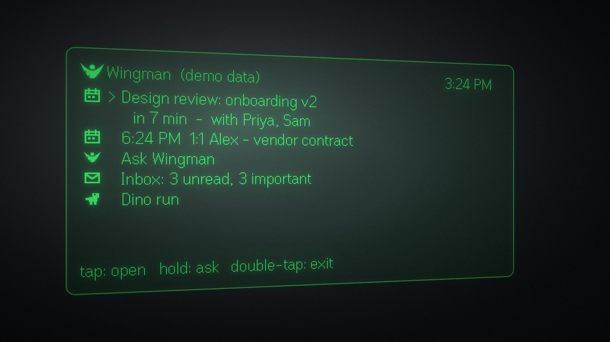
  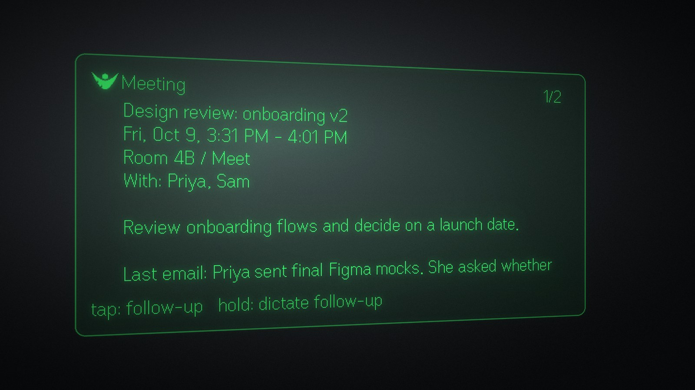
  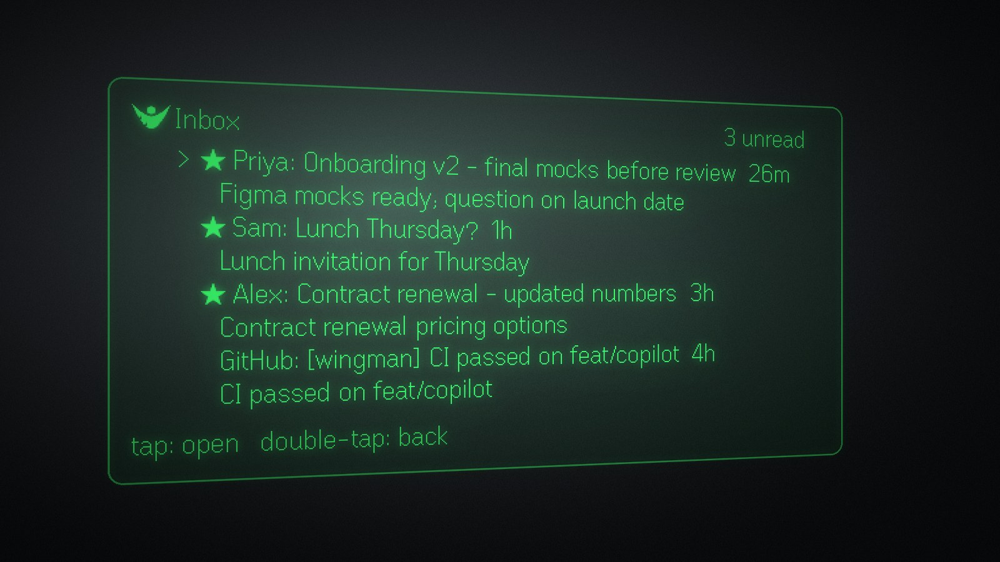
  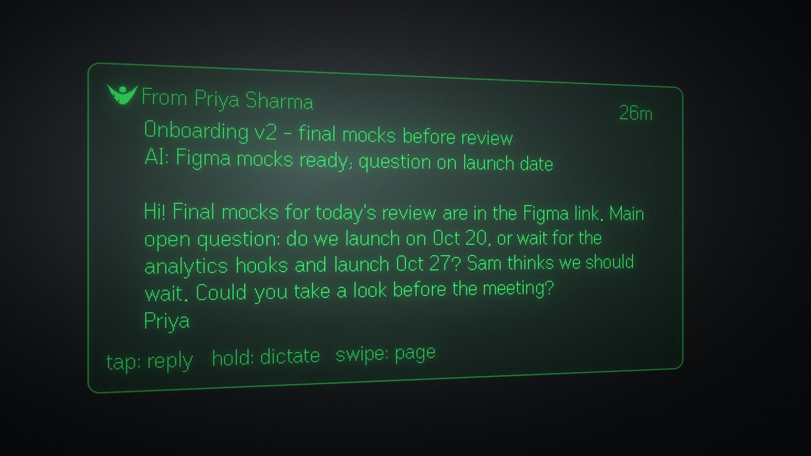
  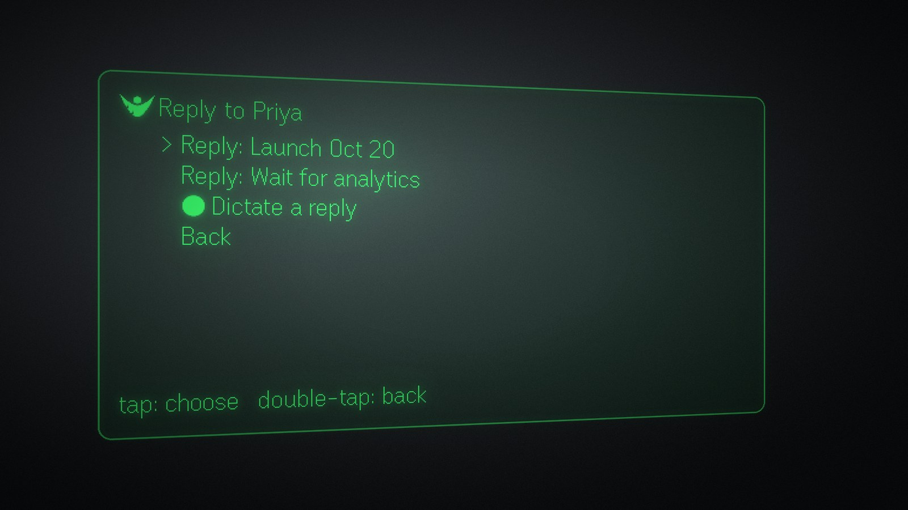
  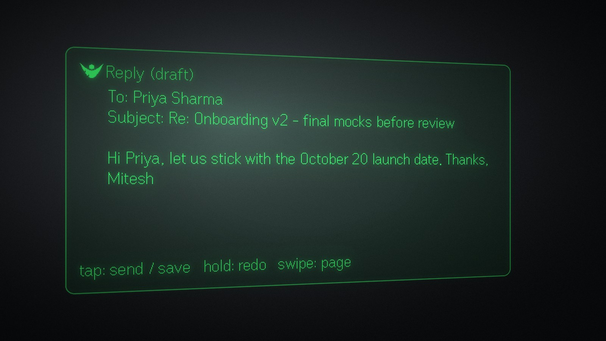
  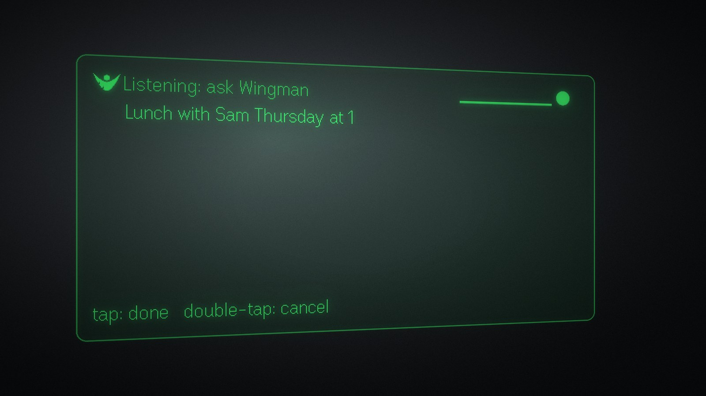
  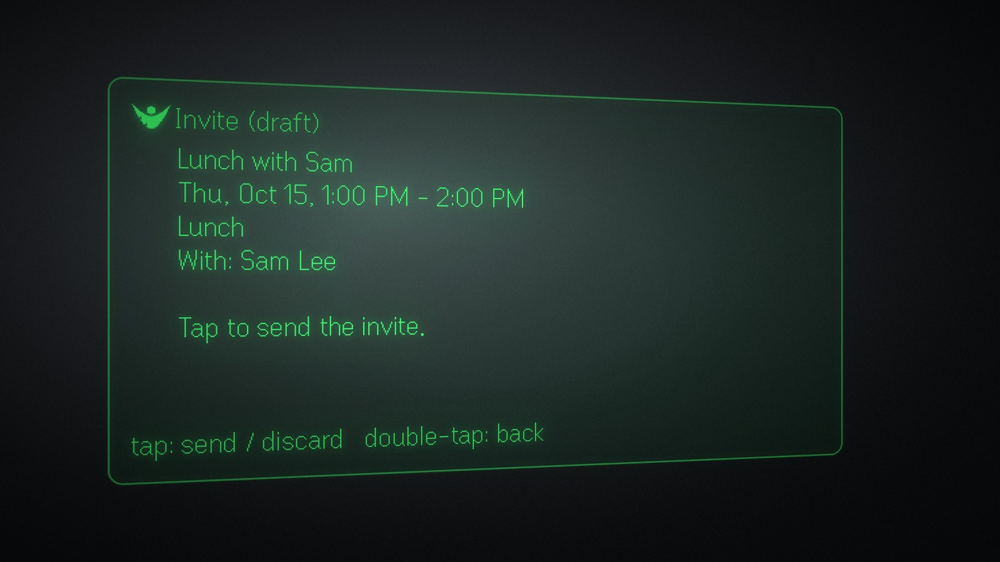
  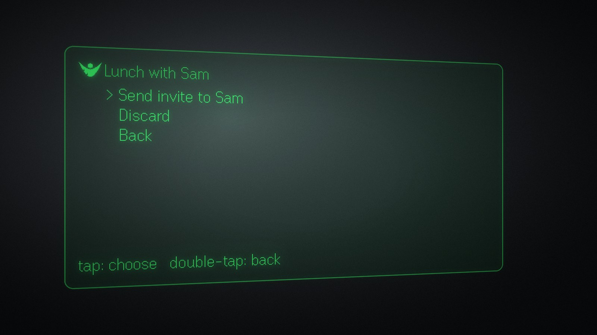
  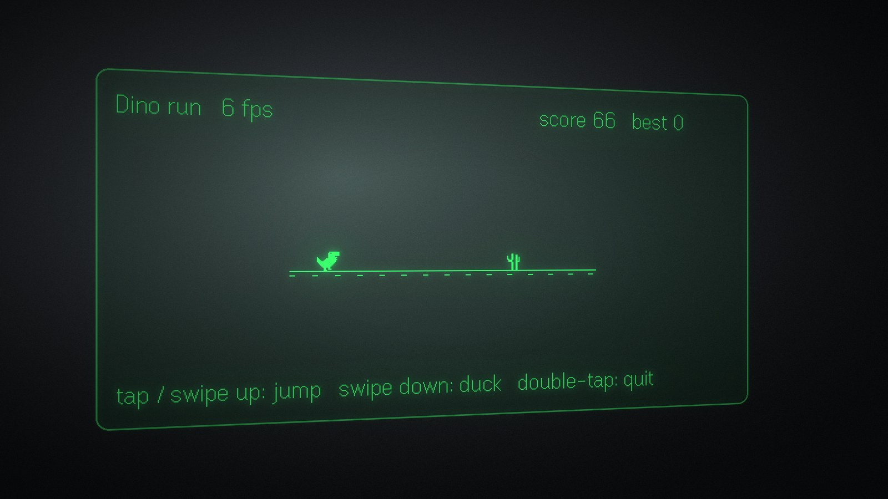


## Getting Started
To get started with Wingman, follow the steps:

#### 1. Clone the repository:
```sh
git clone "https://github.com/MickyG03/wingman.git"
```

#### 2. Install Node JS:
[Node JS]: Make sure you have Node 20 or newer installed on your system. You will also need the [Even Realities app] paired with your G2, and the [everything-evenhub] Claude Code plugin is recommended.
```sh
node --version
```

#### 3. Install Packages:
```sh
cd "wingman/bridge"
npm install
cd "../plugin"
npm install
```

#### 4. Generate a pairing token:
The bridge only accepts clients that present this token. Generate one and keep it for the next step.
```sh
node -e "console.log(require('crypto').randomBytes(24).toString('base64url'))"
```

#### 5. Create .env files:
Copy `bridge/.env.example` to `bridge/.env` and fill in these fields:
```sh
WINGMAN_TOKEN = {your pairing token}
PORT = 8787
USER_NAME = {name used to sign drafts, defaults to your Gmail display name}
FAKE_GOOGLE = 1 (demo data first; set to 0 after step 6)
GEMINI_API_KEY = {your Gemini key}
GEMINI_MODEL = gemini-3.8-flash
GEMINI_FALLBACK_MODEL = gemini-3.5-flash-lite
DEEPGRAM_API_KEY = {your Deepgram key}
DEEPGRAM_MODEL = nova-3
POLL_SECONDS = 180
WORKSPACE_MCP = 0 (1 attaches Google's Workspace MCP servers)
AGENT_MAX_TOOLS = 8
CHAT_TURNS = 20
```
Then copy `plugin/.env.example` to `plugin/.env.local`:
```sh
VITE_BRIDGE_TOKEN = {the same pairing token}
VITE_BRIDGE_URL = (leave empty in dev; the Vite server proxies /bridge to the bridge)
```

#### 6. Connect Google (Gmail, Calendar, Contacts, Drive, Docs and Sheets):
- In the [Google Cloud console], create a project and enable the **Gmail**, **Google Calendar**, **People**, **Google Drive**, **Google Docs** and **Google Sheets** APIs.
- Under **OAuth consent screen**, choose External, leave it in **Testing**, and add your Google address as a test user.
- Under **Credentials**, create an **OAuth client ID** of type **Desktop app**. Download the JSON and save it as `bridge/.data/google-client.json`.
- Set `FAKE_GOOGLE=0` in `bridge/.env`, then sign in. This opens your browser:
```sh
cd "bridge"
npm run auth
```
The token is stored in `bridge/.data/` (git-ignored) and never leaves your PC. While the app is in Testing, Google expires the sign-in after 7 days. The glasses then show **Google sign-in needed**: tap to open the sign-in page on your PC, or run `npm run auth` again.

#### 7. Get Gemini and Deepgram keys:
- Create a free key on [Google AI Studio] for Gemini. Without it, a canned fake writes the drafts.
- Create a key on the [Deepgram console] for speech-to-text. Without it, speech-to-text is a scripted fake.

#### 8. Start the app:
In the project directory, you can run:

- `cd bridge && npm run dev` :
Runs the bridge on port 8787 and reloads when you make changes. The log shows which services are real and which are fake.

- `cd plugin && npm run dev` :
Runs the plugin's Vite server on port 5173, which proxies `/bridge` to the bridge.\
Open [http://localhost:5173](http://localhost:5173) to view the phone companion page in your browser.

- `cd plugin && npm run simulate` :
Opens the desktop glasses simulator, with its automation API on port 9898. `node plugin/scripts/sim.mjs down click shot out.png` drives it from a script. The simulator has no long-press, so use the on-screen **● Speak** items or the phone's **Hold to talk** button.

- `cd bridge && npm test` :
Runs the bridge's unit tests with Vitest: MIME, contacts, AI output validation, send-once drafts and the agent loop.

- `cd plugin && npm test` :
Runs the plugin's tests: reducer flows, chat screens and text layout.

- `cd bridge && npm run smoke` :
Runs every voice flow end to end over the WebSocket (needs `FAKE_GOOGLE=1`).

- `cd plugin && npm run pack` :
Builds the plugin and packages it as `plugin/wingman.ehpk`.

#### 9. Run it on your glasses:
Live reload with a QR code needs Developer Mode, which you get by signing in at [Even Hub]. Scan the code from the Even app's **Even Hub** tab (not the Terminal feature's scanner):
```sh
cd "plugin"
npx evenhub qr --url http://<your-pc-lan-ip>:5173
```
Or install a packaged build. Set `VITE_BRIDGE_URL=ws://<your-pc-lan-ip>:8787/ws` in `plugin/.env.production.local`, put the same address in the `network` whitelist in `plugin/app.json`, and run `npm run pack`. At [Even Hub], open **Projects → Wingman**, upload the build and make it a **Beta**. Invite yourself under **Testing Group**, then scan the QR code in the invite email with your phone's **camera app**. Wingman appears under **Plugins → Beta**.

#### 10. Learn the controls:

| Gesture (temple or ring) | What it does |
|---|---|
| Swipe | Move the cursor, or turn the page |
| Tap | Open the item, or open actions (reply, send, ...) |
| Hold | Talk: on home, the inbox or the chat, ask Wingman anything; on an email, a reply; on a meeting, a follow-up; on a draft, changes to it. Release to finish. |
| Double-tap | Back (exits from home) |

#### 11. Try the agent and the bridge:
Talk to the agent from the terminal (fake data unless `ALLOW_REAL=1`):
```sh
cd "bridge"
npm run chat -- "what is unread"
```
Or connect to the bridge's WebSocket at `ws://localhost:8787/ws` with any WebSocket client. JSON text frames carry these messages, and every request gets an answer with the same `rid`. Here are a few to test:

```
1. Pair (always the first message)
{ "type":"hello", "token":"" }

2. Home: next meeting, unread counts, pending drafts and approvals
{ "rid":1, "type":"home.get" }

3. Triaged inbox
{ "rid":2, "type":"inbox.get" }

4. Meeting briefing
{ "rid":3, "type":"meeting.get", "eventId":"" }

5. Ask Wingman
{ "rid":4, "type":"chat.send", "text":"when am I free tomorrow", "ctx":{ "screen":"chat" } }

6. Approve or discard a prepared action
{ "rid":5, "type":"action.act", "id":"", "action":"approve" }

7. Send, save or discard a draft
{ "rid":6, "type":"draft.act", "draftId":"", "action":"send" }

8. Voice: start, then binary mic frames (PCM s16le, 16 kHz, mono), then stop
{ "rid":7, "type":"voice.start", "ctx":{ "kind":"home" } }
{ "rid":8, "type":"voice.stop" }

and more in "shared/protocol.ts".
```

## Flow Diagrams

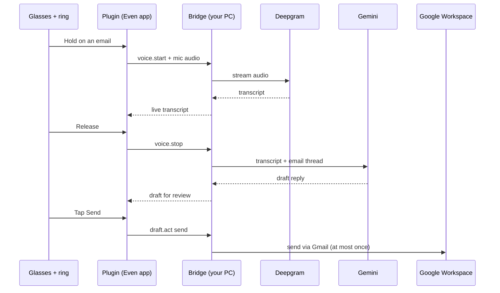

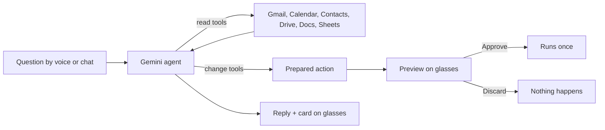

```
G2 glasses + R1 ring ⇄ BLE ⇄ Even app WebView [plugin/]
                                  │  WebSocket: JSON requests + mic audio
                                  ▼
                   bridge/ on your PC (Node)
                    ├─ Gmail, Calendar, People, Drive, Docs, Sheets (your OAuth token stays on the PC)
                    ├─ Gemini: triage, briefings, drafts, the Ask Wingman agent
                    └─ Deepgram: live speech-to-text
```

```
plugin/              Even Hub app, Vite + TypeScript
  src/main.ts        wiring: SDK events -> gestures -> reducer -> effects and display
  src/app/           navigation as a pure reducer (state, action) -> {state, effects}; home items
  src/render/        each screen as header / body / footer text; pixel-accurate wrapping
  src/glasses/       the glasses page and write queue, input mapping, mic, icons
  src/bridge/        WebSocket client: typed requests, pushes, binary audio, reconnect
  src/game/          Dino run
  src/ui.ts          phone companion page: mirror of the glasses plus on-screen controls
  scripts/sim.mjs    drives the desktop simulator through its automation API
bridge/              Node, TypeScript
  src/server.ts      WebSocket server, token check, service wiring
  src/wingman.ts     calendar and inbox cache, briefings, voice flows, draft state
  src/drafts.ts      send-once draft and invite store
  src/google/        Gmail, Calendar, People, Drive, Docs, Sheets, OAuth, MIME; fixtures for demo mode
  src/ai/            Gemini prompts, output validation, fallback model; a canned fake
  src/agent/         Ask Wingman: the tool loop, 22 tools, conversation history, pending actions, MCP
  src/stt/           Deepgram live speech-to-text; a scripted fake
  scripts/           Google sign-in, end-to-end smoke test, terminal chat
shared/protocol.ts   the message contract both packages compile against
```

Why the agent can't act on its own: every tool that changes something returns a prepared action instead of doing it, and the bridge only runs it when the plugin sends `action.act` with `approve` for that id, once. The model can only use ids that came back from its own tool results, so it can't invent an email or file to act on, and email and document contents are passed to it as data, with instructions to ignore anything inside them that looks like a command. Email and calendar content is sent to Gemini to summarize and draft, and your voice is sent to Deepgram, but neither key ever reaches the glasses or phone, and the bridge never logs email bodies or transcripts. Keep the bridge on your home network (or [Tailscale]); it only accepts clients that present `WINGMAN_TOKEN`.


## Tech
For this project I have used following libraries:

- [TypeScript] - A strongly typed programming language that builds on JavaScript. Both the plugin and the bridge are written in it, and `shared/protocol.ts` is compiled by both.
- [Node JS] - A JavaScript runtime built on Chrome's V8 engine. It runs the bridge on your PC.
- [Even Hub SDK] - The SDK for building apps for Even Realities G2 glasses: display containers, touchpad and ring input, microphone and lifecycle events.
- [Even Hub CLI] - Packages the plugin as an `.ehpk` and serves it to the glasses over a QR code.
- [Even Hub Simulator] - A desktop simulator of the G2 display, with an automation API for scripted input and screenshots.
- [Pretext] - Pixel-accurate text measurement matching the glasses' renderer, so text wraps exactly and never overflows.
- [Vite] - A fast frontend build tool and dev server. It also proxies the plugin's WebSocket to the bridge in development.
- [Gemini API] - Google's generative AI models, through the Google Gen AI SDK. Used for triage, briefings, drafts and the Ask Wingman agent's tool calls.
- [Deepgram] - Real-time speech-to-text over a streaming WebSocket.
- [Google APIs] - The Gmail, Calendar, People, Drive, Docs and Sheets clients for Node JS.
- [Model Context Protocol] - An open protocol for connecting models to tools. Used to attach Google's Workspace MCP servers to the agent.
- [ws] - A simple, fast WebSocket client and server for Node JS.
- [tsx] - Runs TypeScript directly in Node JS, with watch mode for development.
- [Vitest] - A fast test framework powered by Vite, used for both packages.

## Development

Want to contribute? Great!
Contributions are welcome! If you have ideas for new features, improvements, or bug fixes, feel free to open an issue or submit a pull request.

## References

1. https://www.evenrealities.com/
2. https://hub.evenrealities.com/docs
3. https://hub.evenrealities.com/docs/learn/claude-code
4. https://ai.google.dev/gemini-api/docs
5. https://developers.deepgram.com/docs
6. https://developers.google.com/gmail/api
7. https://developers.google.com/calendar/api
8. https://developers.google.com/workspace/drive/api
9. https://developers.google.com/identity/protocols/oauth2/native-app
10. https://modelcontextprotocol.io/
11. https://vite.dev/guide/
12. https://vitest.dev/guide/
---

[//]: # (These are reference links used in the body of this note and get stripped out when the markdown processor does its job. There is no need to format nicely because it shouldn't be seen. Thanks SO - http://stackoverflow.com/questions/4823468/store-comments-in-markdown-syntax)

   [Even Realities G2]: <https://www.evenrealities.com/>
   [R1 ring]: <https://www.evenrealities.com/>
   [Even Realities app]: <https://www.evenrealities.com/>
   [Even Hub]: <https://hub.evenrealities.com/>
   [Even Hub SDK]: <https://www.npmjs.com/package/@evenrealities/even_hub_sdk>
   [Even Hub CLI]: <https://www.npmjs.com/package/@evenrealities/evenhub-cli>
   [Even Hub Simulator]: <https://www.npmjs.com/package/@evenrealities/evenhub-simulator>
   [Pretext]: <https://www.npmjs.com/package/@evenrealities/pretext>
   [everything-evenhub]: <https://hub.evenrealities.com/docs/learn/claude-code>
   [Node JS]: <https://nodejs.org/en/download>
   [TypeScript]: <https://www.typescriptlang.org/>
   [Vite]: <https://vite.dev/>
   [Vitest]: <https://vitest.dev/>
   [tsx]: <https://tsx.is/>
   [ws]: <https://github.com/websockets/ws>
   [Gemini API]: <https://ai.google.dev/>
   [Google AI Studio]: <https://aistudio.google.com/apikey>
   [Deepgram]: <https://deepgram.com/>
   [Deepgram console]: <https://console.deepgram.com/>
   [Google Cloud console]: <https://console.cloud.google.com/>
   [Google APIs]: <https://github.com/googleapis/google-api-nodejs-client>
   [Model Context Protocol]: <https://modelcontextprotocol.io/>
   [Tailscale]: <https://tailscale.com/>
